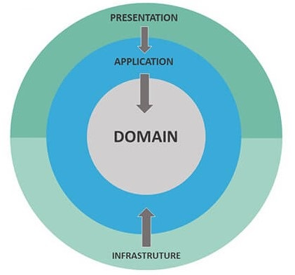
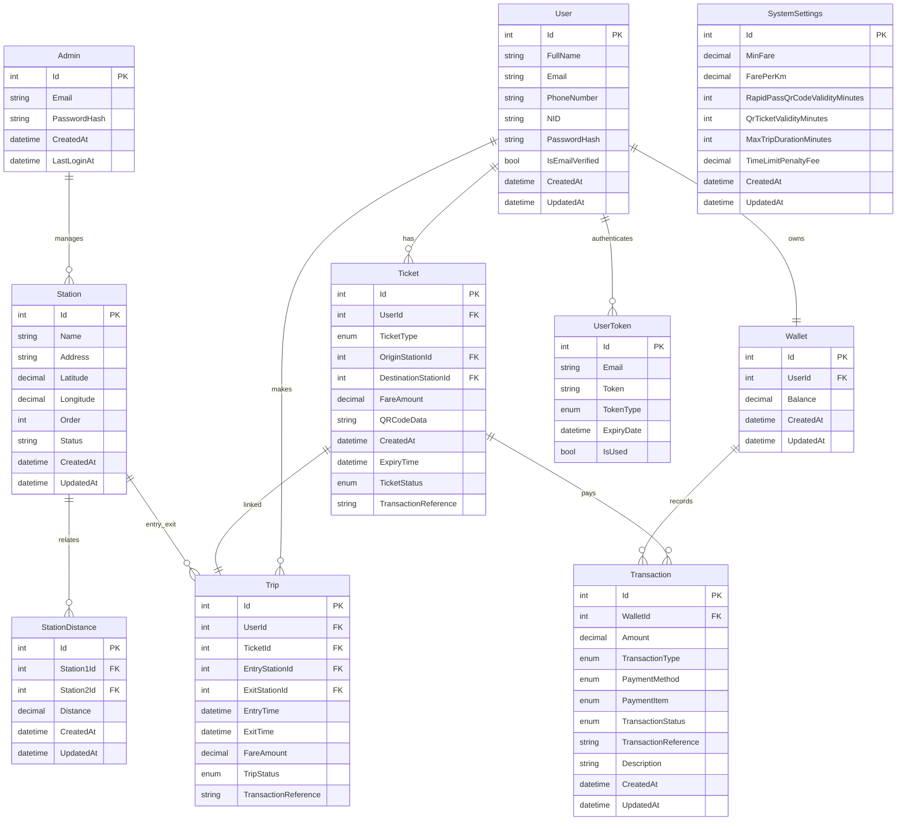

# 🚇 QR Code Based Metro Ticketing System

[](https://dotnet.microsoft.com/download)
[](https://learn.microsoft.com/en-us/aspnet/core/release-notes/aspnetcore-8.0?view=aspnetcore-8.0)
[](https://learn.microsoft.com/en-us/ef/core/what-is-new/ef-core-9.0/whatsnew)
[](https://www.microsoft.com/en-us/sql-server/sql-server-2022)
[](https://redis.io/)
[](https://learn.microsoft.com/en-us/aspnet/core/security/authentication/configure-jwt-bearer-authentication?view=aspnetcore-8.0)
[](https://www.c-sharpcorner.com/article/creating-qrcode-in-asp-net-core/)

<h3 align="center">Fast . Convenient . Cashless</h3>
<br>


<br>

## 👥 Team Information: NetNinjas

| Role | Name | GitHub |
|------|------|--------|
| **Mentor** | Jaber Kibria | [](https://github.com/mhsjaber) |
| **Team Member** | Md Nazmul Hossain | [](https://github.com/nazmulhossin) |
|                 | Sujan Roy | [](https://github.com/sujan-roy24) |
|                 | Rabbani Islam Refat | [](https://github.com/refat75) |


## 📄 Project Description

### 📌 Introduction 
<p align="justify">
The QR Code-Based Metro Ticketing System is your smart companion for hassle-free metro travel. Say goodbye to long queues and paper tickets — with just a few taps, generate a secure QR code, scan it at the station gates, and you’re on your way.
</p>

### 🚀 Key Features

- **QR Code Ticketing:** Instantly generate secure QR codes for your journey — no need for paper tickets.
- **Automatic Fare Deduction:** Automatically records entry and exit stations to calculate and deduct the exact fare.
- **Seamless Digital Payments:** Add balance using mobile banking, credit/debit cards, or digital wallets.
- **Travel & Transaction History:** View detailed logs of your trips, fare deductions, and top-ups.
- **Multi-Ticket Support:** Manage multiple tickets for group or family travel under a single account.
-  **Offline QR Support:** Generate QR codes in advance and use them even when offline.
- **Admin Controls:** Admin dashboard to manage stations, configure system settings, and monitor overall system activity.

## 🌐 Live Demo
Experience the QR Code-Based Metro Ticketing System in action by visiting our live demo:

[](https://dhakametrorail.bsite.net/)

#### 📘 User Guide
- **Home Page**  
  URL: [https://dhakametrorail.bsite.net/](https://dhakametrorail.bsite.net/)  
  The landing page where users can register or log in, check fare, generate RapidPass QR codes, purchase QR tickets, add wallet balance, and view recent trips.

- **Admin Dashboard**  
  URL: [https://dhakametrorail.bsite.net/Admin/](https://dhakametrorail.bsite.net/Admin/)  
  The admin dashboard for managing stations, configuring system settings, and monitoring overall system activity.

  Login Credentials: (`admin@gmail.com` and `admin123`)

- **Scanner Interface**  
  URL: [https://dhakametrorail.bsite.net/System/Scanner](https://dhakametrorail.bsite.net/System/Scanner)  
  This interface is used by the metro station system to scan and validate QR code tickets in real time.

## 📁 Code Structure
This project follows **Clean Architecture** principles and incorporates **industry best practices** to ensure modularity, testability, and maintainability.

### 🔧 Clean Architecture

<p align="center">
  
  <br/>
  <strong>Clean Architecture</strong>
</p>

- **Presentation Layer (`.Web`):** Handles UI rendering and HTTP requests using ASP.NET Core MVC, Razor Views, and APIs.
- **Application Layer:** Contains use-case-specific business logic, service interfaces, and DTOs.
- **Domain Layer:** Encapsulates core entities, value objects, and domain rules — independent of frameworks or infrastructure concerns.
- **Infrastructure Layer:** Provides implementations for data access, external integrations, and repository logic.

### 🛠 Design Patterns & Practices

This project follows well-established industry best practices, including:
- **Dependency Injection:** Enables loose coupling and improves flexibility and testability.
- **Repository Pattern:** Abstracts data access logic, making the codebase more maintainable and testable.
- **Service Layer Abstraction:** Encapsulates business logic and ensures a clear separation of concerns.
- **Unit of Work:** Maintains database consistency by coordinating transactions across multiple repositories.

## 🧩 Use Case Diagram
Illustrates the main interactions between users and the system.


## 🗃️ Entity Relationship (ER) Diagram
Describes the system's data model and relationships among entities.


## 🏁 Getting Started
### Prerequisites
The deployment environment must satisfy the following prerequisites:
- .NET 8.0 SDK or later
- SQL Server
- Redis
- Visual Studio / Visual Studio Code

### Setup Instructions
1. **Clone the repository:**
   ```sh
   git clone https://github.com/Learnathon-By-Geeky-Solutions/netninjas
   cd netninjas
   ```

2. **Configuration Settings**
   
   Edit the `appsettings.json` file located at:  
   `QRCodeBasedMetroTicketingSystem/QRCodeBasedMetroTicketingSystem.Web/appsettings.json`  
   with the following settings:

   ```env
   {
     "ConnectionStrings": {
       "DefaultConnection": "your_sql_server_connection_string",
       "RedisConnectionString": "your_redis_connection_string"
     },
     "AdminSettings": {
       "DefaultEmail": "admin@gmail.com",
       "DefaultPassword": "admin123"
     },
     "EmailSettings": {
       "SmtpServer": "your_smtp_server",
       "SmtpPort": your_smtp_port,
       "SmtpUsername": "your_smtp_username",
       "SmtpPassword": "your_smtp_password"
     },
     "JwtSettings": {
       "SecretKey": "your_jwt_secret_key"
     },
     "QRCodeSecretKey": "your_qr_code_secret_key"
   }
   ```

3. **Database Setup:** 

   Run the Entity Framework Core migration to create the database schema.
   
   - Using Command Prompt / Terminal:
   
     ```sh
     dotnet ef database update
     ```
   - Or, using Visual Studio (Package Manager Console):
     
     ```sh
     Update-Database
     ```
     💡 Ensure that the Default Project in the Package Manager Console is set to `QRCodeBasedMetroTicketingSystem.Infrastructure`

4. **Build and Run the Application**

   Now you are ready to build and run the project:
   - Using Command Prompt / Terminal:
     
     ```sh
     dotnet build
     dotnet run
      ```
   - Or, using Visual Studio:
     
     - Press `Ctrl + F5` to build and run without debugging
     - Or press `F5` to run with debugging
   
   Once the application is running, open your browser and navigate to:
   ```sh
   https://localhost:7157
   ```
   🔗 Update the URL above if your application is configured to run on a different port.

## 🚀 Usage

Once the application is running, you can access the following interfaces:

- **Home Page**  
  URL: [https://localhost:7157/](https://localhost:7157/)  
  This is the landing page for users to explore and interact with the system.

- **Admin Dashboard**  
  URL: [https://localhost:7157/Admin/](https://localhost:7157/Admin/)  
  Use the default admin credentials defined in your `appsettings.json` under `AdminSettings`.

- **Scanner Interface**  
  URL: [https://localhost:7157/System/Scanner](https://localhost:7157/System/Scanner)  
  This interface allows scanning and validating QR-based metro tickets.

> 💡 Replace `localhost:7157` with your actual domain or deployed URL when in a non-local environment.
   
---
